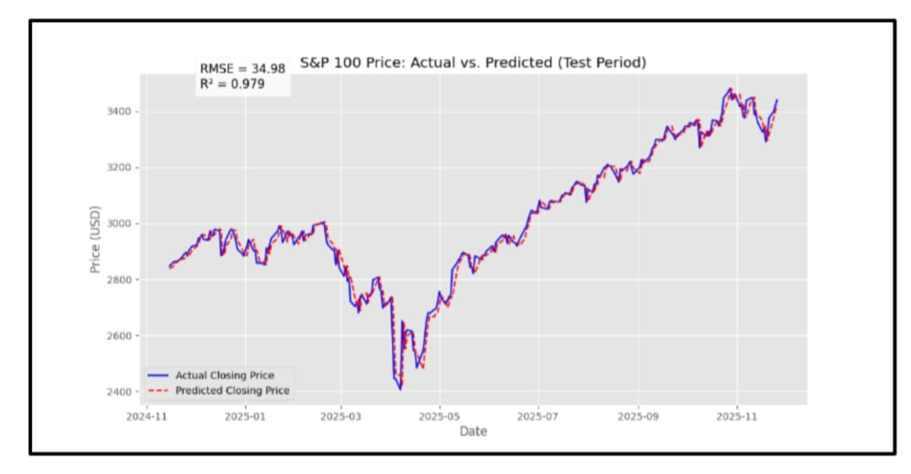
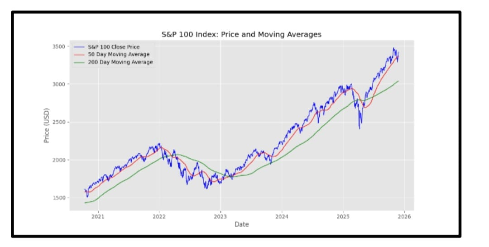
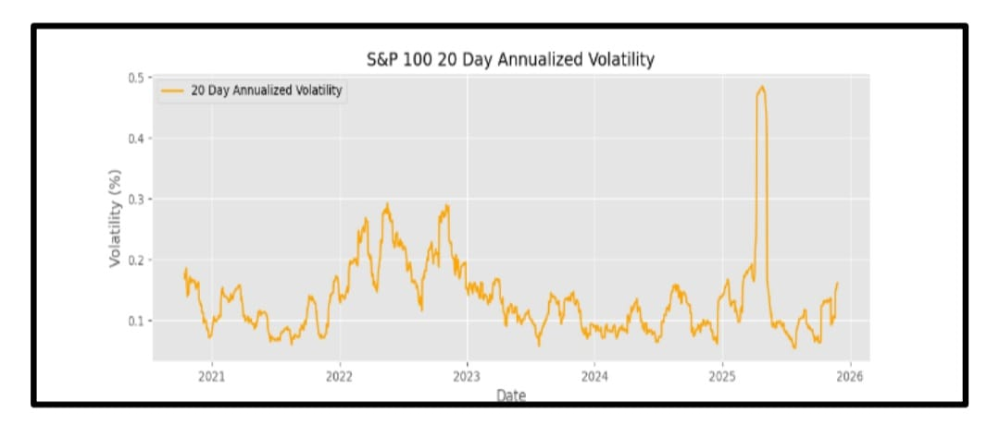

# SP100 Stock Price Predictor

A Python-based stock analysis and prediction tool for the S&P 100 index (^OEX). Collects live historical data, engineers key financial features, and uses Linear Regression to predict the next day's closing price.

**Model Results: RMSE = 34.98 | R² = 0.979**



---

## What it does

- Fetches live S&P 100 historical data from Yahoo Finance (from Jan 2020 to present)
- Cleans and processes the data to remove missing values
- Engineers features: Daily Return, 50-day MA, 200-day MA, 20-day Annualised Volatility
- Trains a Linear Regression model to predict next day's closing price
- Evaluates performance using RMSE and R² metrics
- Exports results to CSV and generates comparison charts

---

## Demo

### Actual vs Predicted Closing Price


### Price and Moving Averages


### 20-Day Annualised Volatility


---

## How it works

| Step | Description |
|------|-------------|
| Data Collection | `yfinance` pulls S&P 100 OHLCV data from Yahoo Finance |
| Feature Engineering | Calculates daily return, 50/200-day moving averages, 20-day volatility |
| Model | Linear Regression (scikit-learn) trained on 80% of data |
| Evaluation | RMSE and R² computed on the 20% test set |
| Output | CSV file + prediction chart saved locally |

---

## Setup

### 1. Clone the repo
```bash
git clone https://github.com/YOUR-USERNAME/sp100-stock-predictor.git
cd sp100-stock-predictor
```

### 2. Install dependencies
```bash
pip install -r requirements.txt
```

### 3. Run the script
```bash
python sp100_predictor.py
```

---

## Requirements

```
yfinance
pandas
numpy
scikit-learn
matplotlib
openpyxl
```

Or install directly:
```bash
pip install yfinance pandas numpy scikit-learn matplotlib openpyxl
```

---

## Output files

| File | Description |
|------|-------------|
| `sp100_data_raw.xlsx` | Raw downloaded data |
| `sp100_final_results.csv` | Actual vs predicted prices + features |
| `sp100_trend_analysis.png` | Closing price with 50/200-day moving averages |
| `sp100_volatility_analysis.png` | 20-day annualised volatility chart |
| `sp100_prediction_vs_actual.png` | Model prediction vs actual prices |

---

## Results

| Metric | Value | Meaning |
|--------|-------|---------|
| RMSE | 34.98 | Average prediction error (on an index in the thousands) |
| R² | 0.979 | Model explains 97.9% of price variation |

> **Note:** The model performs well for short-term trend prediction but has limitations due to linear assumptions and a limited feature set. It may not fully capture sudden market shocks.

---

## Built with

- Python 3
- pandas, numpy
- scikit-learn
- matplotlib
- yfinance

---

## What I learned

- How to build an end-to-end ML pipeline from data collection to evaluation
- Feature engineering for time-series financial data (moving averages, volatility)
- How to properly split time-series data without shuffling to avoid data leakage
- Interpreting RMSE and R² in a real-world financial context

---

## Author

**Mirza Uzair Mehmood Baig**
Mechatronics Engineering, NUST CEME '26
[LinkedIn](https://linkedin.com/in/YOUR-USERNAME) · [GitHub](https://github.com/YOUR-USERNAME)
